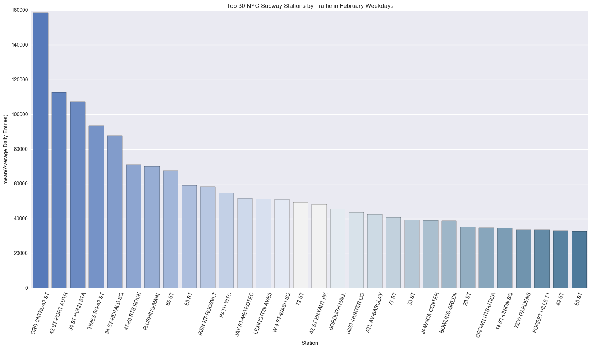

# nyc-subway-canvass
Recommender for best NYC subway stations to canvass to raise awareness about women in tech.

### Goals
A non-profit organization is trying to raise awareness about women in technology. We need to identify the best areas to canvass during the day. The organization will be placing street teams at the entrances to various subway stations in New York City.

### Initial Data Cleaning Approach and Exploratory Findings
We examined the turnstile data from the [MTA website](http://web.mta.info/developers/turnstile.html). For each turnstile, it records the number of entries and exits in time intervals, as well as the date and time and in which subway station the turnstile is placed.

To account for seasonality, we have refined the research question to plan for the canvass to be realized in February 2017. We have then decided to use the MTA data from February 2016 and have also filtered out all data related to weekends or NYC holidays. My focus was only on entries data, having ignored exits.

We have also planned to filter out data from 8pm to 8am but found out that each turnstile had data being recorded in different timing. Most of them had data recorded in 4-hour intervals but some of them started at 8am, while others at 7am or at 7:30 am. To make it harder, some of them had seemingly random timestamps. To avoid having misleading data I have decided not to filter data based on the time of the day.

Having all data from February weekdays segmented by station, we then calculated the average daily entries for each station and selected the top 30 stations with the highest traffic. Here is the result:

### Initial Research Findings

1. **Time of Day** - While figuring out the top subway stations by traffic was useful, data could still be misleading because some stations could have a strong nightlife. We need a better way of coming up with relevant stations.

2. **Audience** - It was important to figure out that to improve the number of women in tech our audience had to be taken into account. Besides studies showing that young people can be more open-minded and receptive to new ideas, high school students are the main group of people who is about to choose a career path in the near future.

3. **Relevancy** - We found out that NYC has the biggest subway in the world by number of stations. The MTA dataset has over 300 stations and that meant that successfully filtering out at least 90% of stations and making a good recommendation had the potential to either make this canvassing project fail or succeed.

### Further Research and Analysis

1. Find out open data about high schools in NYC.
2. Find out data about the location of subway stations in NYC.
3. Match the locations of high schools of interest with subway stations.
